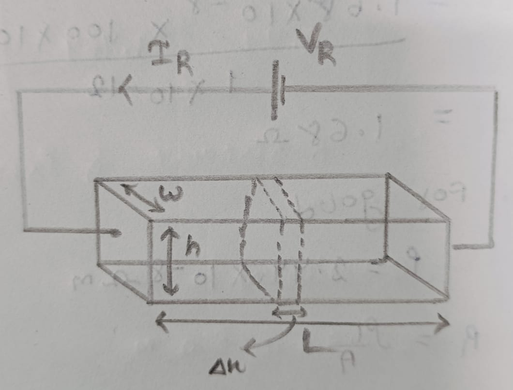

# practice school day 1
## Finding the current inside a material

 
- Given the voltage Vr, Current Ir, dimensions of the material l x w x h and n = $free charge/per unit volume$.
- To find the current Ir = $Change in charge(dQ) / Change in time (dt)$
- Let us take a thin sheet and find the sheet charge (Qs) and Q be the total charge of the material.

  
